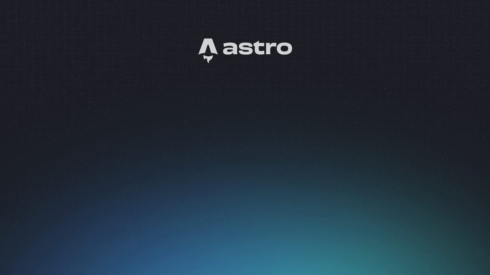

## My First Test Post

todo: verify 2

## Second Title

> > ...by using additional greater-than signs right next to each other...



## Third Title
### Sub title
* point 1
* point 2
  

## Links

[Content from markdown-it](https://markdown-it.github.io/)

## Images


## [Emojies](https://github.com/markdown-it/markdown-it-emoji)

> Classic markup: 🎉 🚀
>
> Shortcuts (emoticons): :-) :-( 8-) ;)

see [how to change output](https://github.com/markdown-it/markdown-it-emoji#change-output) with twemoji.

use [emojipedia](https://emojipedia.org/rocket) to copy-paste emoji directly.

## Note on run test

```npm run dev ``` to see changes in real time.

```npm run build``` to test deployment(pay attention to red error messages) before commiting changes.

```ctrl + C``` to exit.